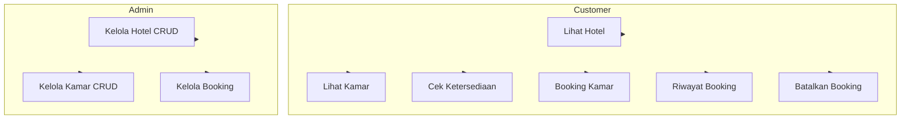
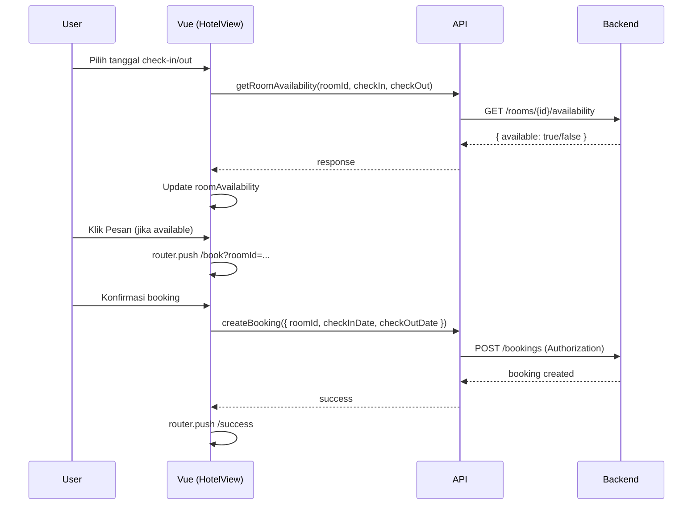
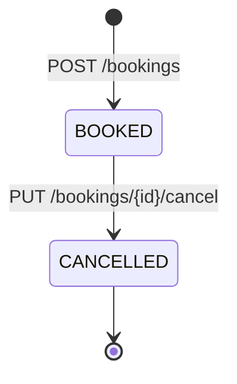
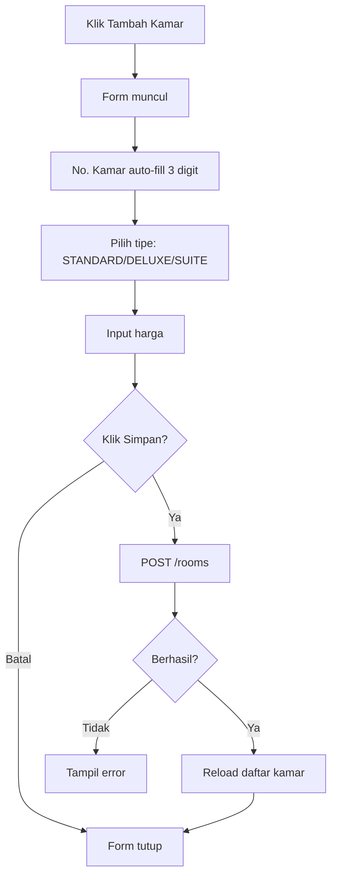

# Diagram UML - Hotel Booking Frontend

Dokumen ini berisi diagram UML untuk aplikasi Hotel Booking (Vue 3).

---

## 1. Class Diagram - Model Data

```
┌─────────────────┐     ┌─────────────────┐     ┌─────────────────┐
│     Hotel       │     │      Room       │     │    Booking      │
├─────────────────┤     ├─────────────────┤     ├─────────────────┤
│ id: string      │1   *│ id: string      │1   *│ id: string      │
│ name: string    │─────│ roomNumber: str │─────│ roomId: string  │
│ location: string│     │ type: string    │     │ room: Room     │
└─────────────────┘     │ price: number   │     │ customerName    │
                         │ hotel: Hotel    │     │ checkInDate     │
                         └─────────────────┘     │ checkOutDate    │
                                                  │ status: string  │
                                                  └─────────────────┘
```

---

## 2. Use Case Diagram (Mermaid)



---

## 3. Use Case - Actor & Use Case (Teks)

| Actor   | Use Case                    | Deskripsi                          |
|---------|-----------------------------|------------------------------------|
| Guest   | Lihat daftar hotel          | Tanpa login                        |
| Guest   | Lihat detail hotel & kamar  | Tanpa login                        |
| Guest   | Cek ketersediaan kamar      | Input tanggal check-in/out         |
| Customer| Login / Register            | Auth                               |
| Customer| Booking kamar               | Perlu login                        |
| Customer| Riwayat booking             | Lihat daftar booking sendiri       |
| Customer| Batalkan booking            | Jika status BOOKED                 |
| Admin   | Kelola hotel (CRUD)         | Tambah/Edit/Hapus hotel            |
| Admin   | Kelola kamar (CRUD)         | Tambah/Edit/Hapus kamar per hotel  |
| Admin   | Kelola booking              | Lihat semua, batalkan              |

---

## 4. Sequence Diagram - Alur Booking (Mermaid)



---

## 5. Component Diagram - Struktur Frontend

```
┌──────────────────────────────────────────────────────────────────┐
│                         App.vue                                   │
│  ┌─────────────────┐  ┌─────────────────┐  ┌─────────────────┐  │
│  │   AppHeader     │  │  RouterView     │  │   AppFooter     │  │
│  └─────────────────┘  └────────┬────────┘  └─────────────────┘  │
└────────────────────────────────┼─────────────────────────────────┘
                                 │
        ┌────────────────────────┼────────────────────────┐
        │                        │                        │
        ▼                        ▼                        ▼
┌───────────────┐    ┌───────────────────┐    ┌───────────────────┐
│  HomeView     │    │  HotelsView       │    │  HotelView         │
│  - Slider     │    │  - HotelCard[]    │    │  - RoomCard[]      │
│  - CTA        │    │  - Filter         │    │  - Filter          │
└───────────────┘    └───────────────────┘    │  - Availability   │
                                              └───────────────────┘
        │                        │                        │
        ▼                        ▼                        ▼
┌───────────────┐    ┌───────────────────┐    ┌───────────────────┐
│  BookingView   │    │  BookingsView     │    │  AdminHotelsView   │
│  - Form        │    │  - Daftar booking │    │  - CRUD Hotel      │
│  - Konfirmasi  │    │  - Filter         │    └───────────────────┘
└───────────────┘    └───────────────────┘             │
                                                         ▼
                                              ┌───────────────────┐
                                              │AdminHotelRoomsView │
                                              │  - CRUD Kamar      │
                                              │  - Auto no.kamar   │
                                              └───────────────────┘
```

---

## 6. State Diagram - Status Booking



---

## 7. Activity Diagram - Tambah Kamar (Admin)



---

## 8. Entity Relationship (Konseptual)

```
Hotel (1) ──────< (*) Room
   │                    │
   │                    │
   └────────────────────┼──────< (*) Booking
                        │            │
                        │            └── customerName (User)
                        └── hotelId
```

---

## Cara Render Mermaid

- **VS Code:** Install ekstensi "Mermaid Preview"
- **GitHub:** Paste di file .md, otomatis di-render
- **Online:** [mermaid.live](https://mermaid.live)
